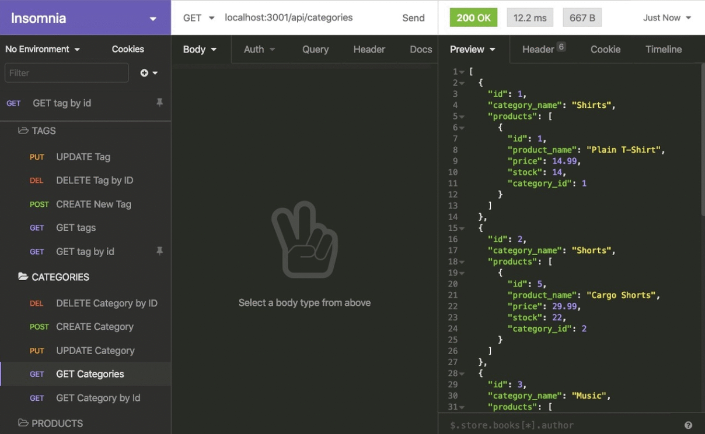

# Ecommerce-Back-End
[Walkthrough Video](https://drive.google.com/file/d/1McrnJwLi_FiBboY21fiPJP1Ar-Qov-kk/view)

## Description

For this project, I created a back end for an Ecommerce website. Using the popular Object-Relational Mapper, Sequelize, I implemented different API endpoints corresponding to the normal CRUD (Create, Read, Update, Delete) operations. This project motivated me because I am now able to connect a front end with a back end, which fulfills basic full-stack requirements!

Here are the models I used:

- `Category`
  - id
  - category_name

- `Product`
  - id
  - product_name (Doesn't allow null values)
  - price
  - stock
  - category_id (References the `category` model's `id`)

- `Tag`
  - id
  - tag_name

- `ProductTag`
  - id
  - product_id (References the `product` model's `id`)
  - tag_id (References the `tag` model's `id`)

## Installation

To install and try out this project, you must install the required dependencies by running 'npm init -y' then 'npm i'. Once that is done, you need to seed the database (using mySQL) and test the endpoints in Insomnia or the application of your choosing.

## License
This application is covered under the MIT license.

## Questions
For questions about the project, you can reach me via:
- GitHub: [Lopez-Jordan](https://github.com/Lopez-Jordan)
- Email: jordanlopezemail@gmail.com
